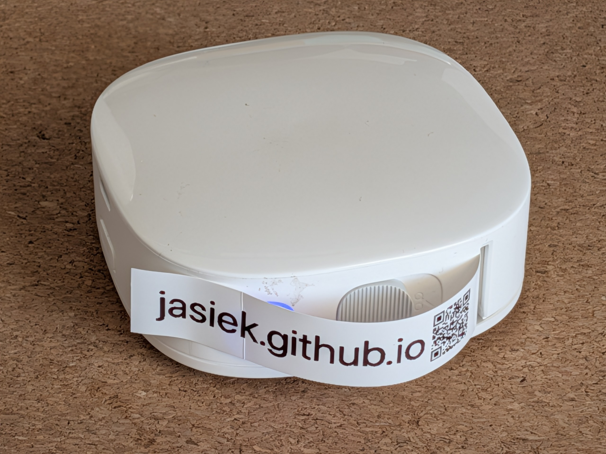

# Xiaomi Mijia MJBQDYJ1-WC — reverse-engineered BLE client

## This is running live at [https://jasiek.github.io/xiaomi-mjbqdyj1-wc-reveng/](https://jasiek.github.io/xiaomi-mjbqdyj1-wc-reveng/)



A Python + TypeScript client for the Xiaomi Mijia Label Printer (model
`MJBQDYJ1-WC`, a China-market 96-dot thermal label printer). The BLE protocol
was recovered from the macOS Xiaomi Home `xiaomi.printer.label` plugin —
see [`FINDINGS.md`](FINDINGS.md) for the full breakdown (AES-CBC framing,
CRC, command layout, chunking rules, notification parsing).

## What's here

- **`client.py`** — `bleak`-based Python client. Scan, query status, print a
  single image, or run as a long-lived HTTP server that keeps the BLE
  session warm.
- **`ts/`** — transport-agnostic TypeScript port of the protocol core, plus
  a Node BLE driver built on top of it.
- **`FINDINGS.md`** — protocol notes.
- **`plugin/`** — the deobfuscated plugin source used as the reference.

## Setup

```bash
pip install -r requirements.txt
```

`bleak` handles BLE on macOS/Linux/Windows. `pycryptodome` provides AES;
`pillow` does image → 1 bpp raster conversion; `aiohttp` powers the server
mode.

## Usage

Scan for the printer:

```bash
./client.py scan
```

Print a single image (auto-resized to 96 dots wide):

```bash
./client.py print lolz.png
```

Run as an HTTP server with an upload form plus explicit connect/disconnect endpoints:

```bash
./client.py serve
```

The HTTP listener starts immediately on port 8071 and binds to all hostnames by default. Then either open `http://localhost:8071/` in a browser and use `Connect via backend`, or:

```bash
curl -X POST http://localhost:8071/connect
curl --data-binary @lolz.png http://localhost:8071/print
curl http://localhost:8071/status
curl -X POST http://localhost:8071/disconnect
```

Once connected, the server holds the BLE session open until `/disconnect` and
serialises connect/disconnect/print operations with an asyncio lock, so
concurrent requests queue safely.

The same SPA can also drive the printer directly from the browser with
WebBluetooth. Run the server above, open the page in Chrome or Edge, and click
`Connect via WebBluetooth...`. WebBluetooth requires a secure context, so it
works from `localhost` during development or from HTTPS when hosted elsewhere.
If both the backend and WebBluetooth are connected, the Print button uses the
direct WebBluetooth session.

## GitHub Pages

GitHub Actions builds and deploys the static WebBluetooth-only app to GitHub
Pages on every push to `master`:

```text
https://jasiek.github.io/xiaomi-mjbqdyj1-wc-reveng/
```

Enable it in GitHub with `Settings -> Pages -> Build and deployment -> Source:
GitHub Actions`. The workflow generates a temporary Pages artifact from
`static/` and deploys it without committing an intermediate `docs/` directory.
The hosted page uses WebBluetooth directly and does not expose the Python
backend controls.

Previously discovered printer identifiers are cached in `.cached-printers`.
Reconnect attempts try those cached identifiers first before falling back to a
fresh scan.

## Hardware notes

- 96 dots wide, 1 bpp raster, MSB = leftmost dot.
- Advertises as `...printer...`; the primary service is `fe95`, writes go
  to characteristic `001f`, notifications arrive on `0020`.
- Frames are `A3 20 <len LE16> <AES-CBC payload> <CRC32 LE>`; the plugin's
  `intToBytesBigEndian` is misnamed — payload multi-byte fields are
  little-endian.
